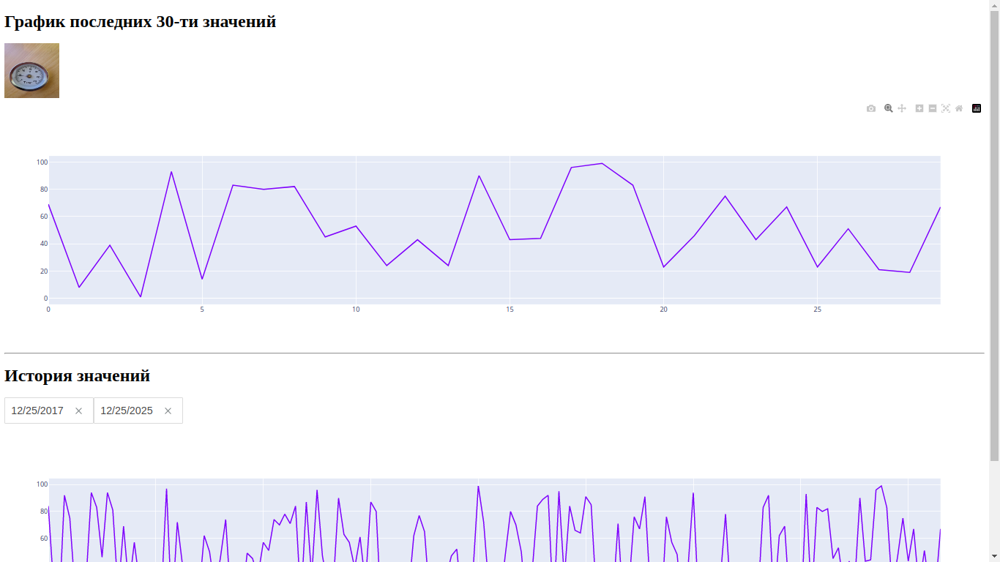
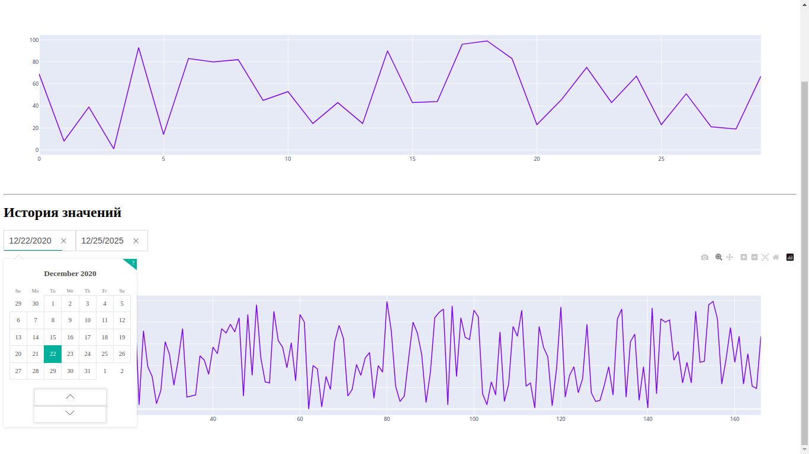

# dash_meter

This program - web dashboard

> Requires
``` bash
pip3 install plotly
pip3 install pandas
pip3 install openpyxl
pip3 install dash
pip3 install cv2
```
***

> Settings and config
``` bash
file: dash_meter/config.py
    PREFIX_FOLDER_IMG = "assets" # path directory images
    NAME_DB_VALUES = "test.xlsx" # plug-in table

file: dash_meter/frontend/view.py
    FILENAME_BANNER_IMAGE = "img.jpg" # path image for banner

file: dash_meter/script_generate_xlsx.py
    COUNT_RECORDS = 200 # number rows in new table
    PREFIX_RANDOM_IMG = "image_random_" # generate_random_xlsx()
    NAME_FILE_RANDOM = "test.xlsx" # generate_random_xlsx()
    NAME_FILE_SORTED = "test.xlsx" # sorted_xlsx_dates()
    NAME_FILE_IMAGES = "assets.xlsx" # for generate_from_image(YOUR_PATH)
    
```
***

> Launch
``` bash
cd dash_meter
python3 main.py # Run server and all program
python3 script_generate_xlsx.py # Run generate table xlsx
```
***


> Demo screen
 
Web-interface



